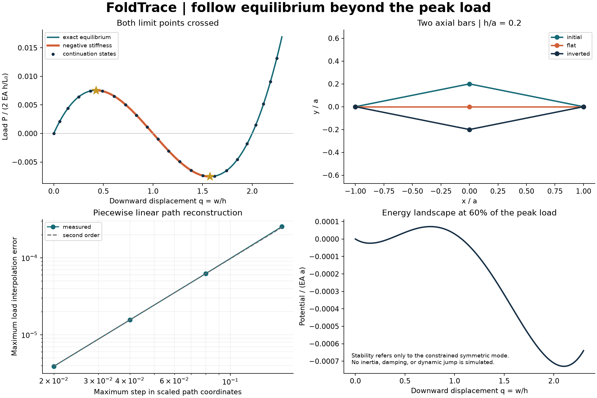

# FoldTrace

**Follow equilibrium beyond the peak load.** An original C++17/Python mechanics
laboratory that traces a symmetric two-bar truss through two limit points and its
negative-stiffness branch. A small model makes every force, derivative, energy,
and accepted continuation state independently auditable.



The C++ core evaluates exact geometry, a consistent tangent, strain energy, and
the augmented Newton corrector. Python controls step acceptance, preserves failure
history, validates against independently derived formulas, and produces figures.
This separation demonstrates a compiled numerical kernel with a usable analysis
layer; no runtime speed advantage is claimed for this very small problem.

## Build and run

Requires Python 3.11+, a C++17 compiler, and CMake 3.20+. On Windows use Visual
Studio 2022 Build Tools with Desktop development with C++ and a Windows SDK.
On Linux use GCC or Clang. A source install compiles the extension; there is no
pure-Python fallback or prebuilt wheel download service.

```bash
python -m venv .venv
# Linux/macOS: source .venv/bin/activate
# Windows PowerShell: .\.venv\Scripts\Activate.ps1
python -m pip install ".[dev]"
foldtrace --output out
python examples/through_the_fold.py
```

For editable development use `python -m pip install -e ".[dev]"`. Reinstall after
C++ changes: the editable extension is not rebuilt automatically. The command
`foldtrace --ratio 0.5 --output out/steeper` changes geometry. Existing generated
files with these names are replaced in the selected output directory. Invalid
arguments, failed numerical acceptance, and I/O errors return exit code 2.

The default command writes `path.csv` (all accepted states and diagnostics),
`convergence.csv` (four path reconstruction resolutions), `validation.json`, and
`equilibrium_audit.png`. Tracked reference outputs are in [results](results/).

## Model and governing equations

Two pin-jointed axial bars join fixed supports at $(\pm a,0)$ to an apex at
$(0,h-w)$. The apex is constrained horizontally. A downward dead load $P$ acts
on it. Both bars have axial rigidity $EA$ and initial length
$L_0=\sqrt{a^2+h^2}$. With current length $L$, use engineering strain and axial
force $N=EA(L-L_0)/L_0$. This is a specified elastic spring/bar model, not a
finite-strain constitutive law for an arbitrary material.

Define

$$r=h/a,\quad q=w/h,\quad \ell=L/a=\sqrt{1+r^2(1-q)^2},
\quad \ell_0=\sqrt{1+r^2},\quad \lambda=P/(2EA h/L_0).$$

Vertical equilibrium gives

$$R(q,\lambda)=f(q)-\lambda=0,\qquad
f(q)=(1-q)\left(\frac{\ell_0}{\ell}-1\right).$$

The consistent tangent and dimensionless strain energy are

$$f'(q)=1-\frac{\ell_0}{\ell^3},\qquad
\bar U(q)=\frac{U}{EAa}=\frac{(\ell-\ell_0)^2}{\ell_0}.$$

The core rationalizes length differences to avoid cancellation near $q=0,2$.
Its force and energy expressions are algebraically equivalent to these formulas.
An independent check verifies
$d\bar U/dq=(2r^2/\ell_0)f(q)$.
At prescribed load the potential is
$\bar\Pi=\bar U-(2r^2/\ell_0)\lambda q$; at an equilibrium, positive $f'$ means
local stability **within this constrained symmetric mode**. Negative $f'$ marks
a potential maximum in that mode. It says nothing about excluded lateral modes.

Setting $f'=0$ produces exact fold locations

$$q_\pm=1\pm\sqrt{\frac{(1+r^2)^{1/3}-1}{r^2}}.$$

For illustrative dimensional scaling, choose $a=1$ m, $h=0.2$ m and $EA=1$ MN:
multiply dimensionless load by $2EA h/L_0$ to obtain newtons, and $q$ by $h$ to
obtain displacement. These are model parameters, not a certified material design.

## Numerical method

Load-controlled Newton would divide by $f'(q)$, which vanishes at a fold.
FoldTrace instead continues in $z=(q,\lambda/s)$, with default load scale $s=r^2$.
At the last accepted point its unit tangent is proportional to $(1,f'/s)$,
oriented consistently with the previous tangent. It predicts
$z_p=z_n+\Delta s\,t$ and corrects using two equations:

$$\frac{f(q)-\lambda}{s}=0,\qquad t^T(z-z_p)=0.$$

The C++ kernel solves the two-by-two Newton system with Jacobian

$$J=\begin{bmatrix}f'/s&-1\\t_q&t_\lambda\end{bmatrix}.$$

At a fold, the tangent is horizontal and this augmented system remains regular.
The implemented constraint is a **tangent hyperplane**, not a spherical
arc-length constraint, and is not claimed to reproduce every detail of Riks'
original algorithm.

Accept only when the Euclidean norm of the two scaled residuals is below the
tolerance, the correction length is at most half the prediction step, and $q$
increases. Otherwise halve the step and retry from the last accepted point.
After acceptance, grow by 1.25 for at most three Newton updates; shrink by 0.7
for seven or more. Bounds cap both changes. This heuristic is a continuation
safeguard, not an a posteriori global error estimator or branch guarantee.

## Python API

```python
from foldtrace import ContinuationError, Truss, trace

truss = Truss(ratio=0.2)
print(truss.force(0.3), truss.tangent(0.3), truss.energy(0.3))
try:
    path = trace(truss, q_stop=2.2, step=0.08, max_step=0.12)
except ContinuationError as error:
    print(error.path.stop_reason, len(error.path.points))
    raise
for point in path.points:
    print(point.q, point.load, point.residual, point.iterations)
```

`trace` starts at $(q,\lambda)=(0,0)$ and returns immutable `Path`/`Point`
dataclasses. The final equilibrium has `q >= q_stop`; it is **not clipped** to
the target. `Point.step` is the predictor length in scaled coordinates;
`residual` is signed $R/s$; `constraint` is the signed hyperplane residual.
`iterations` counts Newton updates and `retries` counts rejected attempts before
that point. `Path.rejected_steps` counts all rejected attempts. Failure paths
also include rejections for the final unaccepted step.

| Setting | Default | Contract |
| --- | --- | --- |
| `ratio` | 0.2 | 0.01 to 10, finite |
| `q_stop` | 2.2 | (0, 3] |
| `step`, `min_step`, `max_step` | 0.08, 1e-5, 0.12 | 0 < min <= step <= max <= 0.5 |
| `load_scale` | ratio squared | finite, positive; changes norm and residual scaling |
| `tolerance` | 1e-11 | [1e-14, 1e-4], scaled residual norm |
| `max_iterations` | 12 | positive integer, per attempt |
| `max_steps` | 10000 | positive integer, accepted-step budget |

Core state evaluations accept finite `q` in [-10,10]. The continuation interface
has the narrower target range above. Budget exhaustion or minimum-step failure
raises `ContinuationError` with the valid partial path and an explicit
`step_budget_exhausted` or `minimum_step_reached` reason. Extreme scaling can
produce `ill_conditioned_scaling`. Invalid inputs raise `ValueError`.
`foldtrace._core.correct` is an internal binding, not the stable high-level API.

## Verification and reproducibility

```bash
python -m pytest --cov=foldtrace --cov-report=term-missing
ruff check .
ruff format --check .
clang-format --dry-run --Werror cpp/continuation.hpp cpp/bindings.cpp cpp/test_continuation.cpp
cmake -S . -B build/native -DFOLDTRACE_PYTHON=OFF
cmake --build build/native --config Release
ctest --test-dir build/native -C Release --output-on-failure
python -m build
python -m pip check
```

C++ tests use explicit checks that stay active in Release builds. C++ compiler
warnings are errors. CI runs Python 3.11 and 3.14 on Ubuntu and Windows, checks formatting,
tests the native core, builds wheel/sdist, reinstalls the wheel, reruns Python
tests, executes the example and campaign, and saves outputs as artifacts.
Dependencies in `requirements-repro.txt` record the local run's Python packages;
this is a snapshot, not a cross-platform lockfile or a compiler lockfile.
PNG byte identity is not promised across font/rendering environments.

The default analytical benchmark produced 23 accepted states (including the
initial state), crossing both folds. Maximum scaled equilibrium residual was
$7.29\times10^{-13}$; independently evaluated force error was below
$2.92\times10^{-14}$. The folds were recovered within $3.34\times10^{-15}$
in $q$. Halving the path step produced reconstruction orders 2.025, 2.003,
and 2.001. These orders concern **piecewise linear interpolation between
equilibrium states**, not Newton convergence order or a temporal discretization.
See the [validation record](docs/validation.md) for exact scope and limitations.

## Scope and limitations

- One symmetric degree of freedom; no assembled general truss network, lateral
  bifurcation, imperfection sensitivity, member buckling, plasticity, or contact.
- Static continuation through unstable states does not simulate the dynamic
  jump. There are no masses, time integrator, damping, or impact model.
- A compressible engineering-strain axial law is used at potentially large
  rotations and strains. Its material validity must be assessed separately.
- The load must reverse to follow the full mathematical path. A monotonically
  increasing physical force cannot visit all the reported states quasistatically.
- Step control is heuristic. Very poor user-selected scaling can obscure force
  accuracy; compare dimensional/independent residuals, not only the scaled norm.
- Only the model's forward single-valued-in-displacement path is supported;
  bifurcation switching, arbitrary residual systems, and restart are not implemented.
- Numerical validation of this benchmark is not certification for design use.

## Provenance and references

The topic was selected from local NFEM lecture **filenames** on nonlinear truss
elements, critical points, and path-following methods. No course handouts,
solutions, exams, private datasets, or course source files were opened or copied.
All implementation, derivations, synthetic geometry, tests, and figures here
were created for this project. Software-lab practices inform packaging, tests,
CI, and a small branch-based Git workflow with the configured author identity.

For the broader continuation context: E. Riks (1979), *An incremental approach
to the solution of snapping and buckling problems*, International Journal of
Solids and Structures 15(7), 529–551,
[doi:10.1016/0020-7683(79)90081-7](https://doi.org/10.1016/0020-7683(79)90081-7).
The primary publisher abstract describes path-length control through critical
points; this project's model formulas and implementation are derived here.

MIT licensed; see [LICENSE](LICENSE). Contributions: [CONTRIBUTING.md](CONTRIBUTING.md).
